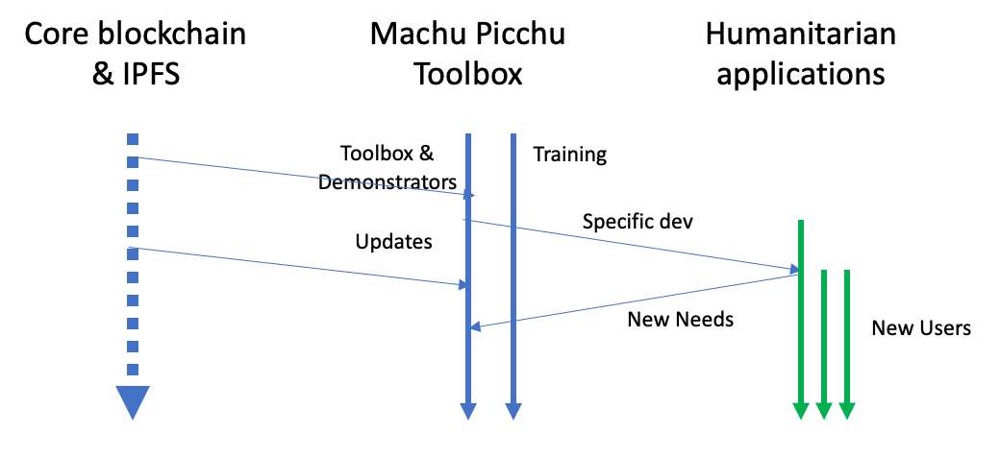

_versión del 4 de julio de 2021_

# Sobre Machu Picchu
## La visión de Machu Picchu
 La visión de Machu Picchu es la siguiente:

### El problema:
* Todas las organizaciones que brindan apoyo a las personas necesitadas en todo el mundo se quejan de que sus datos sobre estas personas son aislados, inconsistentes, no actualizados y costosos de mantener. Idealmente, debería ser precisa y compartida entre todas las organizaciones de ayuda y cumplir con el GDPR. Ver el [White Paper de la Mercy Corp, de la Cruz roja danesa y Hive Online](https://www.hivenetwork.online/blockchain-for-good/).
* Estas organizaciones también se quejan de que las reglas actuales de cumplimiento bancario (FATF, Financial Action Task Force = Grupo de acción financiera internacionale) son demasiado pesadas para que las operaciones bancarias de personas que tienen ingresos inferiores a 50 USD por mes sean rentables, y conllevan costos generales excesivos para las programas de Asistencia en efectivo y cupones (Cash & Voucher Assistance, CVA).
* [Este breve video del Programa Mundial de Alimentos para refugiados](https://youtu.be/f5MQqQy2TOs) resume bien la realidad de campo.

### La solución:
* Machu Picchu permite que cada persona necesitada posea y mantenga sus datos de perfil personal. Los detalles técnicos se describen a continuación.
* Los datos del perfil están disponibles para todas las organizaciones, humanitarias o comerciales, que los utilizan para optimizar sus programas de asistencia. Pagarán una micro-tarifa (algunas tokens) a los propietarios para leer estos datos.
* Estas organizaciones también pueden materializar su CVA como tokens bajo su propia marca (UNICEF, Cruz Roja, Programas Mundiales de Alimentos, Mercy Corps, etc.)
* Las personas necesitadas pueden intercambiar tokens de marca entre ellos para hacer un paquete de un solo tipo de token que vale la pena canjear en un banco o en algunas oficinas de cambio oficiales.
* Machu Picchu tiene como objetivo tratar todas las cuestiones planteadas por las organizaciones humanitarias en el [Informe 2020 de Cash & Voucher Assistance](https://www.calpnetwork.org/fr/publication/the-state-of-the-worlds-cash-2020-full-report/).

## Ventajas de Machu Picchu
Las ventajas son:
* Informar sobre el uso de fondos a los donantes es sencillo;
* La propiedad de los datos permanece en manos de cada persona necesitada;
* Datos de alta calidad;
* Resistencia a la interrupción de la red y a las fallas de almacenamiento localizadas esporádicas;
* Muy bajo costo de operaciones;
* Los tokens no son criptomonedas. Son "unidades de fideicomiso" que pueden canjearse por efectivo real en los servicios financieros oficiales en montos que justifiquen los costos bancarios.

## Las preguntas frecuentes FAQ
Es posible que desee continuar leyendo o [explorar las preguntas frecuentes](./FAQ-es.md) para ver si sus preguntas están ahí.

## ¿Cómo, técnicamente?
Casi todos los proyectos de blockchain almacenan los datos en blockchain. Pero para los casos de uso que no necesitan protección de doble gasto, ni mecanismos de aplicación de la gobernanza, almacenar datos en la cadena de bloques es excesivo. Las tarifas de transacción oscilan entre USD 5 y USD 300 (!).

IPFS (Interplanetary File System) y OrbitDB son soluciones de almacenamiento descentralizadas que no tienen restricciones de validación de datos. Simplemente almacenan los datos. Utilizan criptografía solo para autenticar al propietario (la persona necesitada) y al consumidor (organizaciones de asistencia) de los datos. Almacenemos la mayor parte de los datos en IPFS y almacenemos en la cadena de bloques solo las claves públicas y las direcciones del smart contract que una persona necesitada puede invocar. Al hacerlo, el costo de registro de una persona necesitada en la cadena de bloques oscila entre USD 0,50 y USD 3,00, lo que es asequible.

Las reglas de almacenamiento descentralizado IPFS replican los datos entre 20 pares o menos. Estos compañeros pueden ir y venir. Una [Raspberry Pi 3, computadora ARM pequeña y sin rostro en Linux](https://www.raspberrypi.org/about/), con 250 GB de almacenamiento cuesta USD 50 y puede almacenar datos de 200 mil personas a 1 MB cada una. Si un nodo replica otros 20 nodos, la cifra se reduce a 10 mil personas por nodo. Esto aún hace que el sistema sea altamente escalable para cientos de millones de personas necesitadas, al colocar una Raspberry en cada pocas aldeas o campamentos.

Podemos comenzar a usar los nodos IPFS - OrbitDB existentes y autohospedarnos progresivamente con la solución Raspberry.

## ¿Cómo, prácticamente?
_Una persona necesitada tiene, en el mejor de los casos, un teléfono celular. ¿Cómo podemos dar acceso a blockchain a estas personas?_

Estas personas accederán a la blockchain cadena de bloques a través de su jefe de aldea, o equivalente, que tenga un smartphone o tableta habilitado para la blockchain. Este es un esquema de firmas múltiples que ha sido prototipado por Machu Picchu en un hackatón. El celular envía por SMS una información para completar el perfil. El autor de este SMS será confirmado por el jefe de la aldea en su smartphone o tableta. La transacción se enviará a IPFS para su almacenamiento. Dependiendo de la información, un rastro puede almacenarse o no en la blockchain.

Una vez que se adquiere el hábito de hacerlo, esta firma múltiple puede extenderse a muchos otros usos comunitarios: participación en tareas comunes, incentivos para las buenas prácticas, educación, intercambio descentralizado de tokens, etc.

# ¿Cuál es la hoja de ruta de Machu Picchu?

### El panorama, la big picture
Machu Picchu es de código abierto (open source) y colaborativo.
* El hilo conductor de Machu Picchu es derivar de la caja de herramientas de Machu Picchu aplicaciones específicas adaptadas a las necesidades de las organizaciones humanitarias y de asistencia, y desplegarlas en el campo.
* Dependiente de las necesidades, el segundo hilo conductor de Machu Picchu es construir la caja de herramientas que se pueda adaptar a las aplicaciones del usuario. Dicho esto, este segundo hilo se inicia antes del primer hilo con el fin de tener herramientas concretas para convencer a los humanitarios de que Machu Picchu no es solo una idea sino una realidad.
* El tercer paso es capacitar a las personas interesadas en utilizar la caja de herramientas de Machu Picchu.
* El último hilo, externo a Machu Picchu, es el desarrollo del núcleo de la tecnología descentralizada.

### Desarrollar caja de herramientas Machu Picchu
La caja de herramientas de Machu Picchu se compone de varios componentes:
* demostradores que pueden derivarse en aplicaciones específicas para humanitarios;
* fragmentos de código que se pueden reutilizar en lo anterior como ladrillos de construcción;
* Tutoriales para recién llegados.

Machu Picchu está trabajando en un demostrador que implementa los componentes principales como se describió anteriormente.
1. el registro en la blockchain de las personas necesitadas;
2. el almacenamiento descentralizado de los datos personales;
3. el control de los datos personales por parte de cada una de las personas necesitadas;
4. la extracción estadística de los datos.

Los puntos 1 y 2 están disponibles hoy, en forma de [un juego de disfraces de Pepito](https://pepito-disguises-rinkeby-v011.netlify.app/). 

### Desarrollar aplicaciones de asistencia humanitaria
Como se dijo anteriormente, las ventajas inmediatas de Machu Picchu para una organización humanitaria son:
* Informe inmediato a los donantes sobre cómo se gastan los fondos;
* Los comentarios de los destinatarios (personas necesitadas) están integrados;
* La propiedad y la protección de los datos privados están integradas;
* Caja de herramientas significa personalización para cada situación y aplicación;
* Bajos costos generales;
* Datos de alta calidad, ajustados a las especificaciones de cada actor de CVA.

Las ventajas a largo plazo llegarán cuando más trabajadores humanitarios se unen a Machu Picchu, aprovechando el efecto de red.
* Datos compartidos con otras organizaciones;
* Evidencia de rentabilidad y rentabilidad;
* Sinergia y coordinación entre los diferentes programas de Asistencia en Efectivo y Vales;
* Consenso de evaluación de mercado entre los actores de CVA;
* Sinergia de trabajo en las mismas aldeas o campamentos;
* Atracción de operadores comerciales en la industria agroalimentaria.

# ¿Qué puede hacer USTED ahora por Machu Picchu?
Gracias por haber leído hasta aquí. Machu Picchu busca 3 tipos de participantes.
## Participa como humanitario
Machu Picchu está en continuo desarrollo. En esta etapa, las [disfrazes de Pepito](https://pepito-disguises-rinkeby-v011.netlify.app/) están disponibles para crear un disfraz, almacenar los datos en IFPS / OrbitDB, almacenar las direcciones en la blockchain. El camino por recorrer todavía es largo, pero hagámoslo juntos. Busquemos la financiación y modifiquemos juntos los disfraces de Pepito para satisfacer sus propias necesidades.

Machu Picchu no se apresura a obtener resultados y financiamiento. Sabemos que la tecnología está ahí y la dirección es buena. Pero la herramienta tiene que coincidir con la realidad del campo y cuanto antes trabajemos con las organizaciones humanitarias para ajustar el objetivo, lo mejor es.

## Contribuir como desarrollador(a)
Machu Picchu ha ganado varios premios en hackatones recientes. Contáctenos si siente que hay un hackathon que tiene un tema cercano a las tecnologías de Machu Picchu.

Programiendo Machu Picchu es programiendo _blockchain4good_, con propósito, código abierto, colaborativo. **Contribuya con su código y muestre al mundo sus habilidades**, para el bueno. Cualquier soporte, por pequeño que sea, tiene un valor. La lista de palabras clave es interminable:
* blockchain (cualquier blockchain)
* IPFS, OrbitDB, Textile, Ceramic
* ERC 20, [ERC 721 también conocido como NFT](https://docs.openzeppelin.com/contracts/3.x/erc721)
* alojamiento de nodos, CI / CD, Raspberry Pi (operaciones verdaderamente descentralizadas)
* aplicación móvil, SMS celular (coloque la propiedad de los datos donde pertenece)
* Layer 2 transacciones (menores costos de transacción)
* DEX (intercambio de tokens de diferentes ONG)
* etc. lo que sea
  
## Financiamiento o recaudación de fondos
El propósito de Machu Picchu es brindar herramientas de bajo costo para personas de bajos ingresos en aplicaciones de bajo perfil, pero esto no significa un pequeño mercado de solventes.

La FAO estimó en 2013 que hay más de 500 millones de hogares necesitados. En 2019, los [programas de asistencia en cash y cupones totalizaron en todo el mundo 5,6 mil millones de dólares estadounidenses](https://reliefweb.int/sites/reliefweb.int/files/resources/SOWC2020-Executive-Summary.pdf). Esta cantidad representa solo el 17,9% del total de la asistencia humanitaria internacional. Cualquier porcentaje ganado en costos operativos se traduce en cientos de millones más, para ser compartidos entre Machu Picchu y las personas necesitadas.

# Comentarios: sus preguntas y comentarios
* Consulte las [Preguntas frecuentes](./FAQ-es.md)
* Publique sus comentarios al final de [la publicación de Medium](https://kvutien-yes.medium.com/machu-picchu-how-the-blockchain-can-help-persons-in-need-8396820d13d1)
* Desafía los temas en [las Github issues](https://github.com/kvutien/kvutien.github.io/issues)
