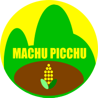

_version of July 1st, 2021_
# Who am I?

| |I am a retired professional of the space and aeronautics industry. My current technical center of interest is the blockchain and Earth Observation. I am certified Ethereum developer by ConsenSys Academy<br> [My LinkedIn Profile](https://www.linkedin.com/in/kvutien/). <br>[My Github Repositories](https://github.com/kvutien) <br>[My Vision: Machu Picchu, Tech4Good](https://kvutien-yes.medium.com/machu-picchu-how-the-blockchain-can-help-persons-in-need-8396820d13d1)|
|-------|:---------|
# My Github account
My Github account is composed of 4 types of repositories
1. **Project** repositories: contain the code of past hackathons (not maintained) or the code of Machu Picchu demos (maintained)
2. **Tutorial** repositories: contain forked tutorials or tutorials I wrote myself. They should be running as-is. Simply fork and clone them, following the instructions.
3. **Reference** repositories: contain industry reference repositories. I forked them in order to be able to do changes. Most of them contain tutorials that can be outdated, and I need to update them, for them to run.
4. **Explore** repositories: contain forked repositories that I might explore in detail some day. Once I make them work, they will be promoted to "tutorials"

All repositories have one of the 4 prefixes in the description. Your interest is most certainly in the tutorial repositories.
# About Machu Picchu
## The vision of Machu Picchu
||Machu Picchu is my current project. The vision of Machu Picchu is as follows:|
|-------|:---------|


### The problem:
* All organizations that support the persons in need worldwide complain that their data concerning these persons are isolated, inconsistent, not up to date and expensive to maintain. Ideally it should be accurate and shared among all helper organizations, and GDPR-compliant. See [White Paper of Mercy Corp, Danish Red Cross and Hive Online](https://www.hivenetwork.online/blockchain-for-good/)
* These organizations also complain that the current banking compliancy rules (FATF) are too heavy to make possible the banking of people who have less than 50 USD revenues per month, and make excessive overhead for the Cash and Voucher Assistance (CVA) prgrams.

### The solution:
* Machu Picchu allows each person in need to own and maintain their own profile data. The technical details will be described below.
* The profile data are available to all organizations, humanitarian or commercial, who use them to optimize their assistance programmes. They will pay a micro-fee (a token) to the owners to read these data.
* These organizations can also materialize their CVA as tokens under their own brand (UNICEF, Red Cross, World Food Programs etc.)
* The persons in need can exchange branded tokens among them to make a bundle that is big enough to be worth being redeemed at a bank or at some official exchange.

## The advantages of Machu Picchu
The advantages are:
* Reporting of the usage of funds to donors is straightforward
* Ownership of the data remains in the hands of each person in need
* High quality of data
* Resilience to network disruption and to single storage failures
* Tokens are not cryptocurrencies. They are "units of trust" that can be redeemed against real cash at official financial services in amounts that justify the banking costs.
## How can it be done technically?
Almost all blockchain projects store the data on the blockchain. But for use cases that don't need double-spending protection, nor governance enforcement mechanisms, storing data on the blockchain is overkill. Transaction fees range between USD 0.50 and USD 300.

IPFS (Interplanetary File System) and OrbitDB are decentralised storage solutions that have no data validation constraints. They just store the data. They use cryptography only to authenticate the owner (the person in need) and the consumer (assistance organizations) of the data. If we store on the blockchain only the public keys and the addresses of the smart contract that a person in need may invoke, the cost of registration of a person in need range between USD 0.50 to USD 3.00, which is affordable.

IPFS decentralised storage rules replicate the data between 20 peers or less. These peers may come and go. This makes the system highly scalable to hundreds of millions of persons in need.
## How can it be done practically?
A person in need has at best a cellular phone. How can we give blockchain access to these people?

These people will access the blockchain through their chief of village, or equivalent, who has a blockchain enabled smartphone or tablet. This is a multisignature schema that has been prototyped by Machu Picchu in one hackathon. The cellular sends via SMS an information to populate the profile. This SMS will be approved by the chief of village on his or her smartphone or tablet. The transaction will be sent to IPFS for storage. Depending on the information, a trace may be stored or not on blockchain.

Once the habit of doing so is acquired, this multisignature can be extended to many other usages: participation to common chores, incentive for good practice, decentralised exchange of tokens etc.


## Placeholder: Welcome to GitHub Pages

You can use the [editor on GitHub](https://github.com/kvutien/kvutien.github.io/edit/main/index.md) to maintain and preview the content for your website in Markdown files.

Whenever you commit to this repository, GitHub Pages will run [Jekyll](https://jekyllrb.com/) to rebuild the pages in your site, from the content in your Markdown files.

### Markdown

Markdown is a lightweight and easy-to-use syntax for styling your writing. It includes conventions for

```markdown
Syntax highlighted code block

# Header 1
## Header 2
### Header 3

- Bulleted
- List

1. Numbered
2. List

**Bold** and _Italic_ and `Code` text

[Link](url) and 
```

For more details see [GitHub Flavored Markdown](https://guides.github.com/features/mastering-markdown/).

### Jekyll Themes

Your Pages site will use the layout and styles from the Jekyll theme you have selected in your [repository settings](https://github.com/kvutien/kvutien.github.io/settings/pages). The name of this theme is saved in the Jekyll `_config.yml` configuration file.

### Support or Contact

Having trouble with Pages? Check out our [documentation](https://docs.github.com/categories/github-pages-basics/) or [contact support](https://support.github.com/contact) and we’ll help you sort it out.
