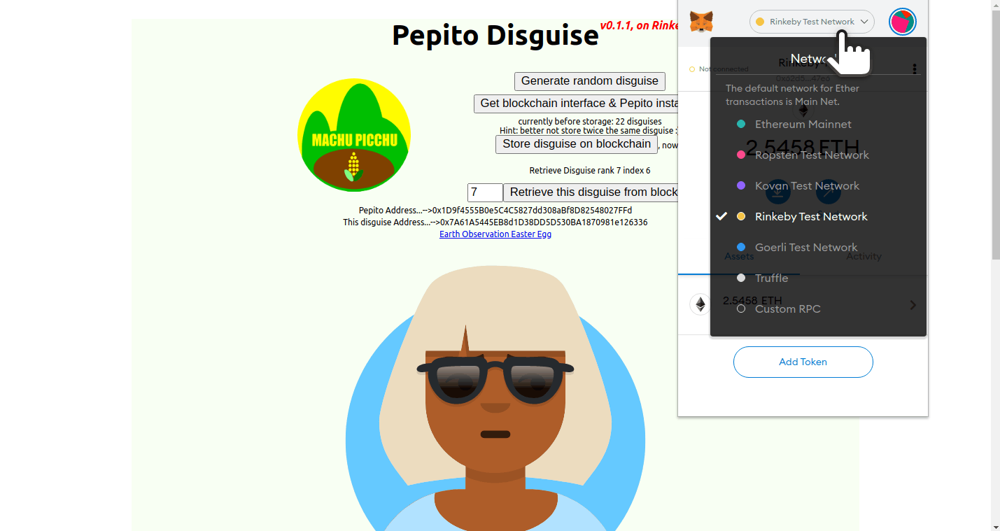

_version of July 4th, 2021_
# Who am I?

 I am a retired professional of the space and aeronautics industry. My current technical center of interest is the blockchain and Earth Observation. I am certified Ethereum developer by ConsenSys Academy<br> [My LinkedIn Profile](https://www.linkedin.com/in/kvutien/). <br>[My Github Repositories](https://github.com/kvutien) <br>[My Vision: Machu Picchu, Tech4Good](https://kvutien-yes.medium.com/machu-picchu-how-the-blockchain-can-help-persons-in-need-8396820d13d1)
## My Github account
My Github account is composed of 4 types of repositories
1. **Project** repositories: contain the code of past hackathons Mach Picchu participated to (not maintained) or the code of Machu Picchu demos (maintained)
2. **Tutorial** repositories: contain forked tutorials or tutorials I wrote myself. They should be running as-is. Simply fork and clone them, following the instructions.
3. **Reference** repositories: contain industry reference repositories. I forked them in order to be able to make changes. Most of them contain tutorials that can be outdated, and I need to update them for them to run.
4. **Explore** repositories: contain forked repositories that I might explore in detail some day. Once I make them work, they will be promoted to "tutorials"

All repositories have one of the 4 prefixes in the description. Your interest is most certainly in the tutorial repositories.
# About Machu Picchu
## The vision of Machu Picchu
 Machu Picchu is my current project. The vision of Machu Picchu is as follows [(_versión española aquí_)](./index-es.md)

### The problem:
* All organizations that support the persons in need worldwide complain that their data concerning these persons are isolated, inconsistent, not up to date and expensive to maintain. Ideally it should be accurate and shared among all helper organizations, and GDPR-compliant. See [White Paper of Mercy Corp, Danish Red Cross and Hive Online](https://www.hivenetwork.online/blockchain-for-good/).
* These organizations also complain that the current banking compliance rules (Financial Action Task Force) are too heavy for the banking of people who have less than 50 USD revenues per month to be profitable, and entail excessive overhead costs for the Cash and Voucher Assistance (CVA) programs.
* [This short video of the World Food Programme for refugees](https://youtu.be/f5MQqQy2TOs) summarizes well the field reality.

### The solution:
* Machu Picchu allows each person in need to own and maintain their personal profile data. The technical details are described below.
* The profile data are available to all organizations, humanitarian or commercial, that use them to optimize their assistance programmes. They will pay a micro-fee (a few tokens) to the owners to read these data.
* These organizations can also materialize their CVA as tokens under their own brand (UNICEF, Red Cross, World Food Programmes, Mercy Corps etc.)
* The persons in need can exchange branded tokens among them to make a bundle of a single kind of token that is worth being redeemed at a bank or at some official exchange offices.
* Machu Picchu aims to address all the issues raised by humanitarians organisations in the [2020 report of Cash & Voucher Assistance](https://www.calpnetwork.org/fr/publication/the-state-of-the-worlds-cash-2020-full-report/).

## Advantages of Machu Picchu
The advantages are:
* Reporting on the usage of funds to donors is straightforward;
* Ownership of the data remains in the hands of each person in need;
* High quality of data;
* Resilience to network disruption and to sporadic localised storage failures;
* Very low cost of operations;
* Tokens are not cryptocurrencies. They are "units of trust" that can be redeemed against real cash at official financial services in amounts that justify the banking costs.

## The FAQ
You may want to continue reading, or [explore the FAQ](./FAQ-en.md) to see if your questions are there.
## How, technically?
Almost all blockchain projects store the data on the blockchain. But for use cases that don't need double-spending protection, nor governance enforcement mechanisms, storing data on the blockchain is overkill. Transaction fees range between USD 5 and USD 300 (!).

IPFS (Interplanetary File System) and OrbitDB are decentralised storage solutions that have no data validation constraints. They just store the data. They use cryptography only to authenticate the owner (the person in need) and the consumer (assistance organizations) of the data. Let's store the bulk of data on IPFS and store on the blockchain only the public keys and the addresses of the smart contract that a person in need may invoke. In doing so, the cost of registration of a person in need in the blockchain range between USD 0.50 to USD 3.00, which is affordable.

IPFS decentralised storage rules replicate the data between 20 peers or less. These peers may come and go. A [Raspberry Pi 3, small and faceless ARM computer on Linux](https://www.raspberrypi.org/about/), with 250 GB of storage costs USD 50 and can store data of 200 thousand persons at 1 MB each. If a node replicates 20 other nodes, the figure is down to 10 thousand persons per node. This still makes the system highly scalable to hundreds of millions of persons in need, by putting one Raspberry in every few villages or camps.

We can start using the existing IPFS - OrbitDB nodes and self-host progressively with the Raspberry solution.

## How, practically?
A person in need has at best a cellular phone. How can we give blockchain access to these people?

These people will access the blockchain through their chief of village, or equivalent, who has a blockchain enabled smartphone or tablet. This is a multisignature scheme that has been prototyped by Machu Picchu in one hackathon. The cellular sends via SMS an information to populate the profile. The originator of this SMS will be confirmed by the chief of village on his or her smartphone or tablet. The transaction will be sent to IPFS for storage. Depending on the information, a trace may be stored or not on blockchain.

Once the habit of doing so is acquired, this multisignature can be extended to many other community usages: participation to common chores, incentives for good practice, education, decentralised exchange of tokens etc.

# What is the roadmap of Machu Picchu?

### The big picture
Mach Picchu is open source and collaborative. 
* The main thread of Machu Picchu is to derive from the Machu Picchu toolbox specific applications tailored to the needs of humanitarians and assistance organizations, and to deploy them on the field.
* Based on the needs, the second thread of Machu Picchu is to build the toolbox that can be adapted to the user applications. This being said, this 2nd thread is started before the 1st thread in order to have concrete tools to convince humanitarians that Machu Picchu is not just an idea.
* The third tread is to train people who are interested to use the Machu Picchu toolbox.
* The last thread, external to Machu Picchu, is the core development of the decentralised technology.


### Develop Machu Picchu toolbox
The Machu Picchu toolbox is composed of several components:
* demonstrators that can be derived into specific applications for humanitarians;
* snippets of code that can be reused in the above as building bricks;
* tutorials for newcomers.

Machu Picchu is working on a demonstrator that implements the main components as described above
1. the blockchain registration of the persons in need;
2. the decentralised storage of the personal data;
3. the control of personal data by each person in need;
4. the statistical extraction of the data;

Points 1 and 2 are available today, in the form of [a game of Pepito disguises](https://pepito-disguises-rinkeby-v011.netlify.app/). 
### Develop humanitarian apps
As said above, the immediate advantages of Machu Picchu for an humanitarian organization are:
* Immediate report to donors on how the funds are spent;
* Feedback from the recipients is built-in;
* Ownership and protection of private data are built-in;
* Toolbox means customization to each situation and application;
* Low overhead costs;
* High quality of data, adjusted to the specs of each CVA actor.

The long term advantages come when more humanitarians join Machu Picchu, leveraging the networking effect
* Shared data with other organizations;
* Evidence of cost-efficiency and cost-effectiveness;
* Synergy and coordination among the different Cash & Voucher Assistance programs;
* Consensus of market assessment among CVA actors;
* Synergy of work on the same villages or camps;
* Attraction of commercial operators in the food and agro industry.

# What can YOU do now for Machu Picchu?
Thank you for having read until here. Machu Picchu is looking for 3 kinds of participants.
## Participate as Humanitarian
Machu Picchu is in continuous development. At this stage, the [Pepito disguises](https://pepito-disguises-rinkeby-v011.netlify.app/) is available to create a disguise, store the data on IFPS/OrbitDB, store the addresses on the blockchain. The road ahead is still long, but let's do it together. Let's find the funding and derive together the Pepito disguises to satisfy your own needs.

Machu Picchu is not rushing to obtain results and funding. We know that the technology is there and the direction is good. But the tool has to match the field reality and the sooner we work with the humanitarian organizations to adjust the aim, the better.

## Contribute as developer
Machu Picchu has won several prizes in recent hackathons. Contact us if you feel that there is a hackathon that has a theme that is close to Machu Picchu's technologies.

Machu Picchu is _blockchain4good_, programming with a purpose, open source, collaborative. **Contribute your code and showcase your skills**, for good. Any support, how small it is, has a value. The list of keywords is endless:
* blockchain (any blockchain)
* IPFS, OrbitDB, Textile, Ceramic
* ERC 20, [ERC 721 aka NFT](https://docs.openzeppelin.com/contracts/3.x/erc721)
* node hosting, CI/CD, Raspberry Pi (truly decentralised ops)
* mobile app, cellular SMS (put data ownership where it belongs)
* Layer 2 (lower costs of transaction)
* DEX (exchange of tokens of different NGOs)
* etc. you name it
  
## Funding, or Raise funding
Machu Picchu's purpose is to provide low cost tools for low income persons in low profile applications, but this doesn't mean a small solvent market.

The FAO estimated in 2013 that there are more than 500 million households in need. In 2019 the [Cash & Voucher Assistance programs totalled worldwide USD 5.6 billions](https://reliefweb.int/sites/reliefweb.int/files/resources/SOWC2020-Executive-Summary.pdf&usg=AOvVaw0ZepAEO1c1PBT_nhM9fmdz). This amount makes for only 17.9% of the total international humanitarian assistance. Any percentage gained in operating costs translates into hundreds of millions more, to be shared between Machu Picchu and the persons-in-need.

# Feedback: your questions and comments
* Check the [Frequently Asked Question](./FAQ-en.md)
* Post your comments at the end of [the Medium post](https://kvutien-yes.medium.com/machu-picchu-how-the-blockchain-can-help-persons-in-need-8396820d13d1)
* Challenge the topics in [the Github issues](https://github.com/kvutien/kvutien.github.io/issues)

# Placeholder: Welcome to GitHub Pages

You can use the [editor on GitHub](https://github.com/kvutien/kvutien.github.io/edit/main/index.md) to maintain and preview the content for your website in Markdown files.

Whenever you commit to this repository, GitHub Pages will run [Jekyll](https://jekyllrb.com/) to rebuild the pages in your site, from the content in your Markdown files.

### Markdown

Markdown is a lightweight and easy-to-use syntax for styling your writing. It includes conventions for

```markdown
Syntax highlighted code block

# Header 1
## Header 2
### Header 3

- Bulleted
- List

1. Numbered
2. List

**Bold** and _Italic_ and `Code` text

[Link](url) and 
```

For more details see [GitHub Flavored Markdown](https://guides.github.com/features/mastering-markdown/).

### Jekyll Themes

Your Pages site will use the layout and styles from the Jekyll theme you have selected in your [repository settings](https://github.com/kvutien/kvutien.github.io/settings/pages). The name of this theme is saved in the Jekyll `_config.yml` configuration file.

### Support or Contact

Having trouble with Pages? Check out our [documentation](https://docs.github.com/categories/github-pages-basics/) or [contact support](https://support.github.com/contact) and we’ll help you sort it out.
