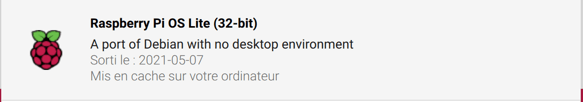

_version of September 3, 2021_
# Machu Picchu: Persistent IPFS node on Raspberry Pi3 - Part 2

 The following is an explanation of how I installed a Raspberry Pi 3 Model B+ to serve as a persistent IPFS node in Machu Picchu. <br>[My Vision: Machu Picchu, Tech4Good](https://kvutien-yes.medium.com/machu-picchu-how-the-blockchain-can-help-persons-in-need-8396820d13d1)

Here is a quick description of Machu Picchu if you are new to it.

*	IPFS is an Internet protocol to decentralize storage of data.
*	The persons-in-need can publish their profile data and their needs using IPFS. Like what we do on LinkedIn, but here each person keeps ownership of the data, and it's spread over peers, not stored on any central server.
*	The credentials of data ownership of these persons are stored on a blockchain.
*	All humanitarians can read the profiles and optimize their assistance programs. They may also use this blockchain to manage these assistance programs.
*	The better the data, the more assistance a person can expect. This motivates the person to maintain quality data.
*	When national central banks will issue digital money (CBDCs), humanitarians can use Machu Picchu to distribute CBDCs directly as _Cash & Voucher Assistance_, and people can use it to pay the foods, the tools, their education, medical services etc.

This document is composed of 2 parts:
* [Part 1](./index.md) explains the Raspberry Pi and why it interests Machu Picchu. You may want to read it to get acquainted with this Single Board Computer and its community. It might also give you ideas how to use it for your own project.
* [Part 2](./index-2.md) is a hands-on list of steps to install and deploy IPFS. This is what you are reading.

Although I'm doing my best to explain each step, at some point you might need to do a Google search for more details. Your lifesaver, whenever you are puzzled by an error message in the installation, is to paste in Google the text of the error message followed by "Stackexchange". 

## Shipment as delivered by LABISTS(Tm)
All starter kits are more or less the same. The one that I ordered is composed of:
*	A Raspberry Pi3 Model B+ board ("*Model B*" means "*with wi-fi*").
*	A 5V-2.5A power supply with micro-USB connector.
*	A 3-part black plastic enclosure.
*	Two heat sinks for the CPU & the DRAM.
*	One 32 GB micro-SD card pre-loaded with NOOBS installer (_New Out-Of-Box Software_) to install the OS of your choice.
*	One USB card reader with one USB A end and one USB C end. It is needed when you need to burn another Linux distribution not listed in the NOOBS installer.
*	One HDMI cable.

# Build the kit
Peel off the protective layer of the double side adhesive tape on the heat sinks and glue them on the Broadcom CPU (top side) and on the DRAM (bottom side). Press gently.

  

Assembling the rest of the case is straightforward. Slide the circuit board on the bottom layer of the case. Don't assemble the rest until the software is installed. It will be more practical for your installation steps as below. See the title photo as an example. 

Advantages of doing so: First it's easier to see the green flashing LED that signals any access to the micro-SD. Second you may often need to remove the micro-SD card to try flashing several kinds of OS.

# List of installation steps
1.	Burn the boot micro-SD card and configure it for wi-fi access.
2.	Boot and open `ssh` session.
3.	In `ssh` session, change hostname and password.
4.	Initiate new `ssh` session with the new hostname and password.
5.	Update and upgrade all software packages.
6.	Prepare the mounting of the SSD.
7.	Install IPFS and check IPFS access.

Steps 1 to 5 inclusive are derived from the following blog article: https://desertbot.io/blog/headless-raspberry-pi-3-bplus-ssh-wifi-setup
<br>Steps 6 and 7 are derived from the following blog article: https://desertbot.io/blog/headless-raspberry-pi-4-external-ssd

## 1. Burn the boot micro-SD card and configure it for wi-fi access
*	Insert the micro-SD card into the USD adapter and insert the adapter on your laptop. <br>    
*   Launch *Raspberry Pi Imager* on your laptop to select the OS and flash it in the micro-SD card. The video showing how to use the software is at https://www.youtube.com/watch?v=ntaXWS8Lk34. Unlike step 2.5 of the video, don't choose any option. Choose *"Raspberry Pi OS (other)"* followed by *"Raspberry Pi OS Lite (32 bit)"*. Choose the storage *"Mass Storage Device Media - 31.9 GB"* and flash the card.  On MacOS, you need to give your administrator password.
<br>  
<br>  
<br> 
*	Once the micro-SD card is flashed and verified, it will be "ejected" by MacOS. Remove the micro-SD card USB adapter and reinsert it back in your laptop. It appears on the Finder Desktop as a volume named `boot`. Place an empty file named `ssh` (no extension) in the root of this boot volume. It will signal that `ssh` should be enabled and it will be deleted automatically after first boot.
<br> 
*	To do so on MacOS, in Terminal, type `touch /Volumes/boot/ssh`
*	Create another file `wpa_supplicant.conf`: type `touch /Volumes/boot/wpa_supplicant.conf`

*	Using any MacOS text editor, paste the following instructions into `wpa_supplicant.conf`, adjusting for your ISO 3166 alpha-2 country code, changing to your wi-fi network name (SSID) and wi-fi network password, both between quotes:
```bash
    country=LU
    ctrl_interface=DIR=/var/run/wpa_supplicant GROUP=netdev
    update_config=1

    network={
        ssid="your wi-fi SSID"
        psk="your-wifi-password-example204877"
    }
```
*	Quit the MacOS editor. Eject the USB adapter. Remove the micro-SD card. Now we can work on the Raspberry Pi.

## 2. Boot and open `ssh` session
* insert the micro-SD card in the RPi3, connect it to its power supply and switch power on. Wait for the green LED to stop blinking. It will take more or less 5 minutes. Check in the list of terminals on your wi-fi router that a machine named `raspberrypi` has appeared.
 <br>  
* On your MacOS Terminal, connect to the RPi3. First, make sure to reset with the command `ssh-keygen` any previous parameters of `ssh` sessions made to `raspberrypi.local`. If you have never connected to such a host, MacOS will say `failed`. It's normal.
```bash
    MBP18VTK:~ kvutien$ ssh-keygen -R raspberrypi.local
    do_known_hosts: hostkeys_foreach failed: No such file or directory
```
*	If like me you have already connected by `ssh` to a host with that name in previous attempts, your MacOS will tell you that it has updated its system file named `.ssh/known_hosts`.
```bash
    MBP18VTK:~ kvutien$ ssh-keygen -R raspberrypi.local
    # Host raspberrypi.local found: line 1
    /Users/kvutien/.ssh/known_hosts updated.
    Original contents retained as /Users/kvutien/.ssh/known_hosts.old
```
*	Now you can `ssh` to the RPi3. Your Mac will tell you that it cannot establish the authenticity of this host and ask you to confirm that you still want to establish this session
```
    MBP18VTK:~ kvutien$ ssh pi@raspberrypi.local
    The authenticity of host 'raspberrypi.local (2001:7e8:ccdd:e000:f124:2430:a6d:c314)' can't be established.
    ECDSA key fingerprint is SHA256:AagTtr9Bcb3VZBsWK2tWFd8CxRfWmCbGyPsA8gsPX4w.
    Are you sure you want to continue connecting (yes/no)? 
```
* Answer `yes` and give the default password of all RPi, which is "`raspberry`". If you have never connected to a host with this name, here is what you will see.
```
    pi@raspberrypi.local's password: 
    Warning: Permanently added 'raspberrypi.local,2001:7e8:ccdd:e000:f124:2430:a6d:c314' (ECDSA) to the list of known hosts.
```
*	If like me you have previously connected to a host with that name, you'll have a routine `ssh` session feedback.
```
    pi@raspberrypi.local's password: 
    Linux raspberrypi 5.10.17-v7+ #1414 SMP Fri Apr 30 13:18:35 BST 2021 armv7l

    The programs included with the Debian GNU/Linux system are free software;
    the exact distribution terms for each program are described in the
    individual files in /usr/share/doc/*/copyright.

    Debian GNU/Linux comes with ABSOLUTELY NO WARRANTY, to the extent
    permitted by applicable law.

    SSH is enabled and the default password for the 'pi' user has not been changed.
    This is a security risk - please login as the 'pi' user and type 'passwd' to set a new password.
```
## 3. In `ssh` session, change hostname and password
*	Cross-check the IP address from the RPi3 with the command `ifconfig`. We can see the IP address of the RPi3 in wlan0. We see that it's the same as seen by the wi-fi router above, `192.168.178.43`. Incidentally we have confirmation, from the MAC address of the form `b8:27:eb:xx:xx:xx`, that it's indeed the Raspberry Pi (https://macaddress.webwat.ch/hwaddr/B8:27:EB)
```
    pi@raspberrypi:~ $ ifconfig
    eth0: flags=4099<UP,BROADCAST,MULTICAST>  mtu 1500
            ether b8:27:eb:7b:f1:b6  txqueuelen 1000  (Ethernet)
            RX packets 0  bytes 0 (0.0 B)
            RX errors 0  dropped 0  overruns 0  frame 0
            TX packets 0  bytes 0 (0.0 B)
            TX errors 0  dropped 0 overruns 0  carrier 0  collisions 0

    lo: flags=73<UP,LOOPBACK,RUNNING>  mtu 65536
            inet 127.0.0.1  netmask 255.0.0.0
            inet6 ::1  prefixlen 128  scopeid 0x10<host>
            loop  txqueuelen 1000  (Local Loopback)
            RX packets 0  bytes 0 (0.0 B)
            RX errors 0  dropped 0  overruns 0  frame 0
            TX packets 0  bytes 0 (0.0 B)
            TX errors 0  dropped 0 overruns 0  carrier 0  collisions 0

    wlan0: flags=4163<UP,BROADCAST,RUNNING,MULTICAST>  mtu 1500
            inet 192.168.178.43  netmask 255.255.255.0  broadcast 192.168.178.255
            inet6 fe80::d168:288d:80ee:e23c  prefixlen 64  scopeid 0x20<link>
            inet6 2001:7e8:ccdd:e000:f124:2430:a6d:c314  prefixlen 64  scopeid 0x0<global>
            ether b8:27:eb:2e:a4:e3  txqueuelen 1000  (Ethernet)
            RX packets 2359  bytes 222393 (217.1 KiB)
            RX errors 0  dropped 0  overruns 0  frame 0
            TX packets 110  bytes 16815 (16.4 KiB)
            TX errors 0  dropped 0 overruns 0  carrier 0  collisions 0
```
*	We have to change the hostname and the password. We use the command `passwd` to change password.
```
    pi@raspberrypi:~ $ passwd
    Changing password for pi.
    Current password: 
    New password: 
    Retype new password: 
    passwd: password updated successfully
```
*	We use `sudo raspi-config` to change the hostname from the default `raspberrypi` to `ipfs-pi`, or any name of your choice. Type "Carriage Return" to select an option, or move to another option using the arrow keys. Once this done, select `Finish` and `Reboot`.
<br>  
<br>  
<br>  
<br>  
<br>  
<br>  
*	When rebooting the RPi3 the `ssh` session with `raspberrypi.local` is closed. We are back to the MacOS console.
```
    pi@raspberrypi:~ $ sudo raspi-config
    Connection to raspberrypi.local closed by remote host.
    Connection to raspberrypi.local closed.
    MBP18VTK:~ kvutien$
```

## 4. Initiate new `ssh` session with the new hostname and password
*	The new `ssh` session should use now the new hostname and password. First, make sure to reset with the command `ssh-keygen` any previous parameters of `ssh` session connecting to `ipfs-pi.local`. If you have never connected to a host with that name, your mac will say `failed`.
```
    MBP18VTK:~ kvutien$ ssh-keygen -R ipfs-pi.local
    do_known_hosts: hostkeys_foreach failed: No such file or directory
```
*	If like me you have connected to such a host and are re-installing the RPi3, your MacOS will tell you that it has updated its system file named `.ssh/known_hosts`.
```
    MBP18VTK:~ kvutien$ ssh-keygen -R ipfs-pi.local
    # Host ipfs-pi.local found: line 1
    /Users/kvutien/.ssh/known_hosts updated.
    Original contents retained as /Users/kvutien/.ssh/known_hosts.old
```
*	Now you can establish a `ssh` session to the RPi3. Your MacOS will inform you that it cannot establish the authenticity of this host and ask you to confirm that you still want to establish this session
```
    MBP18VTK:~ kvutien$ ssh pi@ipfs-pi.local
    The authenticity of host 'ipfs-pi.local (2001:7e8:ccdd:e000:f124:2430:a6d:c314)' can't be established.
    ECDSA key fingerprint is SHA256:AagTtr9Bcb3VZBsWK2tWFd8CxRfWmCbGyPsA8gsPX4w.
    Are you sure you want to continue connecting (yes/no)? 
```
*	Answer "`yes`" and give the new password that you created above with the command `passwd`. If you have never connected to a host with that name, here is what you will see.
```
    pi@ipfs-pi.local's password: 
    Warning: Permanently added 'raspberrypi.local,2001:7e8:ccdd:e000:f124:2430:a6d:c314' (ECDSA) to the list of known hosts.
```
*	If like me you have connected to such a host, you'll have a routine `ssh` session feedback.
```
    Warning: Permanently added 'raspberrypi.local,2001:7e8:ccdd:e000:f124:2430:a6d:c314' (ECDSA) to the list of known hosts.
    pi@ipfs-pi.local's password: 
    Linux ipfs-pi 5.10.17-v7+ #1414 SMP Fri Apr 30 13:18:35 BST 2021 armv7l

    The programs included with the Debian GNU/Linux system are free software;
    the exact distribution terms for each program are described in the
    individual files in /usr/share/doc/*/copyright.

    Debian GNU/Linux comes with ABSOLUTELY NO WARRANTY, to the extent
    permitted by applicable law.
    Last login: Thu Sep  2 11:29:05 2021 from 2001:7e8:ccdd:e000:c007:79fa:be03:ef52
```

**Important note**: If you have already used this hostname and password before you reinstalled the OS, and if you forgot to reset the ssh key using `ssh-keygen`, your MacOS will complain loudly and refuse to establish the `ssh` session.

## 5. Update and upgrade all software packages
In this first `ssh` session with the new hostname and password, let's get the latest OS and software updates. This is a recommended practice every time you install from scratch a Linux distribution.
```
    pi@ipfs-pi:~ $ sudo apt-get update -y
    ...
    pi@ipfs-pi:~ $ sudo apt-get upgrade -y
    ...
    pi@ipfs-pi:~ $  sudo apt autoremove
    ...
```
## 6. Prepare the mounting of the SSD
Now we can plug the Samsung SSD and start installing IPFS on it. We need some care with Raspbian file permissions here because we are playing at the low level of the file system as a casual user `pi` and some commands have to be given as user `root`. Follow carefully the explanations.

*	Plug the Samsung SSD on one USB port of the RPi3.
*	Using `ssh` on Terminal, use the `lsblk` command to list storage ("block") devices. The SSD is seen as `sda` (Storage Device A) and its first partition is `sda1`.
```
    pi@ipfs-pi:~ $ lsblk -o UUID,NAME,FSTYPE,SIZE,MOUNTPOINT,LABEL,MODE
    UUID                                 NAME        FSTYPE   SIZE MOUNTPOINT LABEL      MODE
                                        sda                465.8G                       brw-rw----
    344C-FEA0                            `-sda1      exfat  465.8G            Samsung_T5 brw-rw----
                                        mmcblk0             29.7G                       brw-rw----
    5DE4-665C                            |-mmcblk0p1 vfat     256M /boot      boot       brw-rw----
    7295bbc3-bbc2-4267-9fa0-099e10ef5bf0 `-mmcblk0p2 ext4    29.5G /          rootfs     brw-rw----
```
*	Check the disk partitions of `sda` using `fdisk` ("format disk", a command to be issued as `root`)
```
    pi@ipfs-pi:~ $ sudo fdisk -l | grep sda
    Disk /dev/sda: 465.8 GiB, 500107862016 bytes, 976773168 sectors
    /dev/sda1        2048 976770112 976768065 465.8G  7 HPFS/NTFS/exFAT
```
*	To read the SSD, which is formatted as `exfat`, install on the RPi3 the `exfat` driver that handles this format `exfat` in a virtual file system of Linux (`exfat-fuse` and `exfat-utils`):
```
    pi@ipfs-pi:~ $ sudo apt install exfat-fuse
    Reading package lists... Done
    Building dependency tree       
    Reading state information... Done
    The following additional packages will be installed:
    exfat-utils
    The following NEW packages will be installed:
    exfat-fuse exfat-utils
    0 upgraded, 2 newly installed, 0 to remove and 0 not upgraded.
    Need to get 67.7 kB of archives.
    After this operation, 260 kB of additional disk space will be used.
    Do you want to continue? [Y/n] 
    Get:1 http://ftp.acc.umu.se/mirror/raspbian/raspbian buster/main armhf exfat-fuse armhf 1.3.0-1 [27.5 kB]
    Get:2 http://ftp.acc.umu.se/mirror/raspbian/raspbian buster/main armhf exfat-utils armhf 1.3.0-1 [40.3 kB]
    Fetched 67.7 kB in 6s (12.2 kB/s) 
    perl: warning: Setting locale failed.
    perl: warning: Please check that your locale settings:
        LANGUAGE = (unset),
        LC_ALL = (unset),
        LC_CTYPE = "UTF-8",
        LANG = "en_GB.UTF-8"
        are supported and installed on your system.
    perl: warning: Falling back to a fallback locale ("en_GB.UTF-8").
    locale: Cannot set LC_CTYPE to default locale: No such file or directory
    locale: Cannot set LC_ALL to default locale: No such file or directory
    Selecting previously unselected package exfat-fuse.
    (Reading database ... 40457 files and directories currently installed.)
    Preparing to unpack .../exfat-fuse_1.3.0-1_armhf.deb ...
    Unpacking exfat-fuse (1.3.0-1) ...
    Selecting previously unselected package exfat-utils.
    Preparing to unpack .../exfat-utils_1.3.0-1_armhf.deb ...
    Unpacking exfat-utils (1.3.0-1) ...
    Setting up exfat-utils (1.3.0-1) ...
    Setting up exfat-fuse (1.3.0-1) ...
    Processing triggers for man-db (2.8.5-2) ...
```
*	Create a mount point under the `/mnt` folder, by creating a folder `xdisk`, under which all the contents of the SSD will be reachable.
```
    pi@ipfs-pi:~ $ sudo mkdir /mnt/xdisk
    pi@ipfs-pi:~ $ ls -ls /mnt
    total 4
    4 drwxr-xr-x 2 root root 4096 Aug 31 14:09 xdisk
```
*	Change permissions of folder `xdisk`. This is needed because the folder `xdisk` belongs to user `root` of group `root`. As it is now, we as user `pi`, have no write permission in this folder. To prove it, let's create a file `test.txt` as user `pi`. It will be refused. Now create this same file as `root` using `sudo`. It will succeed.
```
    pi@ipfs-pi:~ $ touch /mnt/xdisk/test.txt
    touch: cannot touch '/mnt/xdisk/test.txt': Permission denied
    pi@ipfs-pi:~ $ sudo touch /mnt/xdisk/test.txt
    pi@ipfs-pi:~ $ ls -ls /mnt/xdisk
    total 0
    0 -rw-r--r-- 1 root root 0 Sep  2 13:44 test.txt
```
Not very practical because user `pi` (and other users) will only be allowed to read the content of the SSD. We need to change file permission with `sudo chmod`. We add write permission to all users and groups to the folder `/mnt/xdisk`. We check with the command `ls -ls` that everybody has read-write-execute access to `xdisk`.
```
    pi@ipfs-pi:~ $ sudo chmod a+w /mnt/xdisk
    pi@ipfs-pi:~ $ ls -ls /mnt
    total 4
    4 drwxrwxrwx 2 root root 4096 Sep  2 13:44 xdisk
```
Let's check the result. Delete (as owner `root`) the file `test.txt`, using the command `sudo rm`. Create it again as user `pi`. Observe that this action is not refused anymore: the owner of this file is now user `pi`.
```
    pi@ipfs-pi:~ $ sudo rm /mnt/xdisk/test.txt
    pi@ipfs-pi:~ $ ls -ls /mnt/xdisk
    total 0
    pi@ipfs-pi:~ $ touch /mnt/xdisk/test.txt
    pi@ipfs-pi:~ $ ls -ls /mnt/xdisk
    total 0
    0 -rw-r--r-- 1 pi pi 0 Sep  2 13:54 test.txt
```
*	Write something into the file with the Linux editor `nano`, for example "This is a test" and check the content with the command `cat`. Observe that the string "_This is a test_" is indeed the content of `test.txt`.
```
    pi@ipfs-pi:~ $ nano /mnt/xdisk/test.txt
```
...
```
    pi@ipfs-pi:~ $ cat /mnt/xdisk/test.txt
    This is a test
```
Until now, we have played with this folder as if it were any Linux folder, without mounting the SSD. Let's empty the folder because we'll now use it as a mounting point for the SSD, and for this the folder must be empty. 
```
    pi@ipfs-pi:~ $ rm /mnt/xdisk/test.txt
    pi@ipfs-pi:~ $ ls -ls /mnt/xdisk
    total 0
```
*	Mount the SSD (device `/dev/sda1`) at the mounting point `/mnt/xdisk`. Check with the command `df` ("disk free") that it is recognized by the file system.
```
    pi@ipfs-pi:~ $ sudo mount /dev/sda1 /mnt/xdisk
    FUSE exfat 1.3.0
    pi@ipfs-pi:~ $ df -h
    Filesystem      Size  Used Avail Use% Mounted on
    /dev/root        29G  1.4G   27G   5% /
    devtmpfs        430M     0  430M   0% /dev
    tmpfs           462M     0  462M   0% /dev/shm
    tmpfs           462M  6.2M  456M   2% /run
    tmpfs           5.0M  4.0K  5.0M   1% /run/lock
    tmpfs           462M     0  462M   0% /sys/fs/cgroup
    /dev/mmcblk0p1  253M   49M  204M  20% /boot
    tmpfs            93M     0   93M   0% /run/user/1000
    /dev/sda1       466G   54M  466G   1% /mnt/xdisk
```
We have one last thing to do with the file system before installing IPFS. Edit `fstab` (it is the system configuration file that contains all available disks, disk partitions and their options, that are static parameters of the file system) to make the SSD mount on reboot. For this doing, get the PARTUUID of the external drive.
```
    pi@ipfs-pi:~ $ sudo blkid | grep sda1
    /dev/sda1: LABEL="Samsung_T5" UUID="344C-FEA0" TYPE="exfat" PARTUUID="cab80be4-01"
```
*	Edit the file `etc/fstab` . Do it for example with the editor `nano` (type the command `sudo nano /etc/fstab`) and in `nano` copy-paste the following line
```
    PARTUUID=cab80be4-01 /mnt/xdisk exfat defaults,auto,users,rw,nofail,x-systemd.device-timeout=30,umask=000 0 0
```
*	Restart the RPi3. Check that the command `df -T` sees the auto-mounted SSD. Here we see the SSD as device `/dev/sda1`, its file system is `fuseblk` and it is mounted on `/mnt/xdisk`. 
```
    pi@ipfs-pi:~ $ sudo shutdown now -r
    Connection to ipfs-pi.local closed by remote host.
    Connection to ipfs-pi.local closed.

    MBP18VTK:~ kvutien$ ssh pi@ipfs-pi.local
```
...
```
    pi@ipfs-pi.local's password: 
    ...
    pi@ipfs-pi:~ $  df -T
    Filesystem     Type     1K-blocks    Used Available Use% Mounted on
    /dev/root      ext4      30384508 1445636  27671172   5% /
    devtmpfs       devtmpfs    439400       0    439400   0% /dev
    tmpfs          tmpfs       472680       0    472680   0% /dev/shm
    tmpfs          tmpfs       472680    6340    466340   2% /run
    tmpfs          tmpfs         5120       4      5116   1% /run/lock
    tmpfs          tmpfs       472680       0    472680   0% /sys/fs/cgroup
    /dev/sda1      fuseblk  488384000   55040 488328960   1% /mnt/xdisk
    /dev/mmcblk0p1 vfat        258095   50110    207985  20% /boot
    tmpfs          tmpfs        94536       0     94536   0% /run/user/1000
    pi@ipfs-pi:~ $  ls -ls /mnt/xdisk
    total 16896
    128 -rwxrwxrwx 1 root root      118 Jan 20  2016 'Samsung portable SSD SW for Android.txt'
    9856 -rwxrwxrwx 1 root root 10091479 Apr 29  2020  SamsungPortableSSD_Setup_Mac.pkg
    6784 -rwxrwxrwx 1 root root  6817336 Apr 29  2020  SamsungPortableSSD_Setup_Win.exe
```
From now on, the SSD is immediately mounted at boot time if it is plugged in. If it is plugged only after boot, type `sudo mount -a` and the file system using `fstab` will make it mount automatically at `/mnt/xdisk`.

## 7. Install IPFS and check IPFS access
We can now start installing IPFS. It is the easiest part.
*	Check that `git` is installed already on the RPi3, if not, install it.
```
    pi@ipfs-pi:~ $ git version
    -bash: git: command not found
    pi@ipfs-pi:~ $ sudo apt install git
    Reading package lists... Done
    ...
```
*	In the SSD (use `cd /mnt/xdisk`), as user `root`, clone with `git` the IPFS installation script. When you cloned the script, `git` should have stored it into a folder that matches the name of the git repository (`ipfs-rpi`)
```
    pi@ipfs-pi:~ $ cd /mnt/xdisk
    pi@ipfs-pi:/mnt/xdisk $ sudo git clone https://github.com/claudiobizzotto/ipfs-rpi.git
    Cloning into 'ipfs-rpi'...
    remote: Enumerating objects: 60, done.
    remote: Total 60 (delta 0), reused 0 (delta 0), pack-reused 60
    Unpacking objects: 100% (60/60), done.
    pi@ipfs-pi:/mnt/xdisk $ ls -ls
    total 16896
    128 -rwxrwxrwx 1 root root      118 Jan 20  2016 'Samsung portable SSD SW for Android.txt'
    9856 -rwxrwxrwx 1 root root 10091479 Apr 29  2020  SamsungPortableSSD_Setup_Mac.pkg
    6784 -rwxrwxrwx 1 root root  6817336 Apr 29  2020  SamsungPortableSSD_Setup_Win.exe
    128 drwxrwxrwx 1 root root   131072 Aug 31 19:45  ipfs-rpi
```
*	Go into the cloned folder `ipfs-rpi` and start the installation script
```
    pi@ipfs-pi:/mnt/xdisk $ cd ipfs-rpi
    pi@ipfs-pi:/mnt/xdisk/ipfs-rpi $ ./install
    >>> Starting installation on ARM device compatible with ? (unknown ARM system)
    >>> Installing IPFS version v0.10.0-rc1
    /tmp/go-ipfs_v0.10.0-rc1_linu 100%[================================================>]  19.86M  4.51MB/s    in 4.2s    
    >>> Starting IPFS
    generating ED25519 keypair...done
    peer identity: 12D3KooWEoUcXH1CxWLFsniPyBmhG3ZcWoYAi2Z2DMRgYCjCbGWc
    initializing IPFS node at /home/pi/.ipfs
    to get started, enter:

        ipfs cat /ipfs/QmQPeNsJPyVWPFDVHb77w8G42Fvo15z4bG2X8D2GhfbSXc/readme

    Created symlink /etc/systemd/system/multi-user.target.wants/ipfs-daemon.service → /lib/systemd/system/ipfs-daemon.service.
    >>> All done.
```
*	Successful IPFS installation. Retrieve and display from IPFS the welcome file.
```
    pi@ipfs-pi:/mnt/xdisk/ipfs-rpi $ ipfs cat /ipfs/QmQPeNsJPyVWPFDVHb77w8G42Fvo15z4bG2X8D2GhfbSXc/readme
    Hello and Welcome to IPFS!

    ██╗██████╗ ███████╗███████╗
    ██║██╔══██╗██╔════╝██╔════╝
    ██║██████╔╝█████╗  ███████╗
    ██║██╔═══╝ ██╔══╝  ╚════██║
    ██║██║     ██║     ███████║
    ╚═╝╚═╝     ╚═╝     ╚══════╝

    If you're seeing this, you have successfully installed
    IPFS and are now interfacing with the ipfs merkledag!

    -------------------------------------------------------
    | Warning:                                              |
    |   This is alpha software. Use at your own discretion! |
    |   Much is missing or lacking polish. There are bugs.  |
    |   Not yet secure. Read the security notes for more.   |
    -------------------------------------------------------

    Check out some of the other files in this directory:

    ./about
    ./help
    ./quick-start     <-- usage examples
    ./readme          <-- this file
    ./security-notes
```