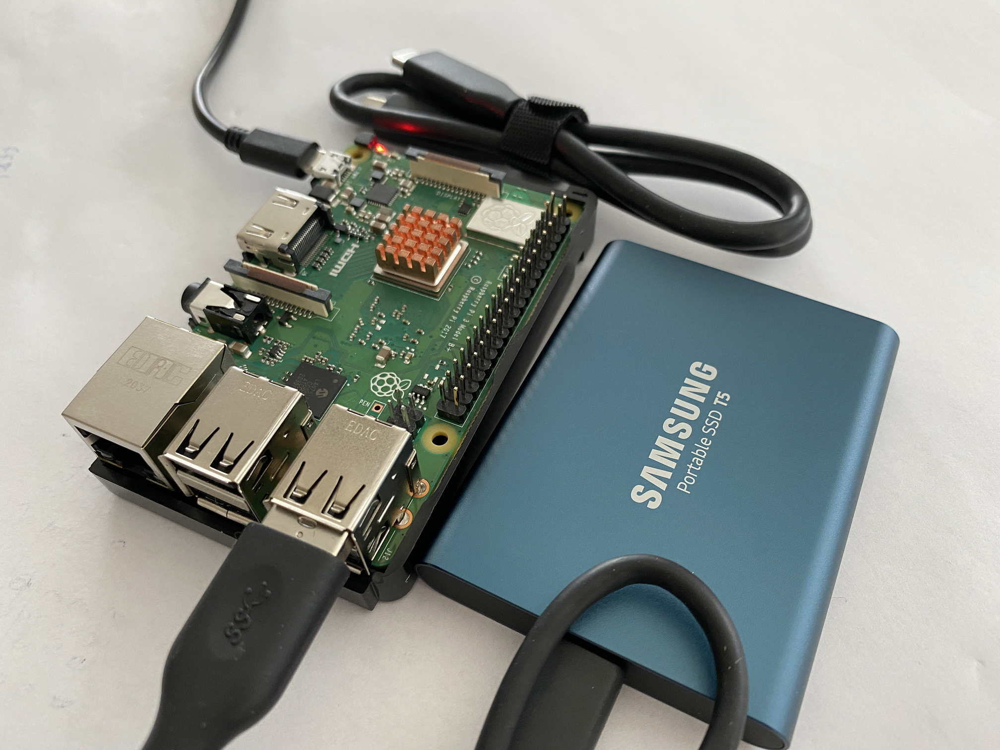

_version of September 3, 2021_
# Machu Picchu: Persistent IPFS node on Raspberry Pi - Part 1

 The following is an explanation of how I installed a Raspberry Pi 3 Model B+ to serve as a persistent IPFS node in Machu Picchu.  [My Vision: Machu Picchu, Tech4Good](https://kvutien-yes.medium.com/machu-picchu-how-the-blockchain-can-help-persons-in-need-8396820d13d1)

## Machu Picchu _Tech4Good_, IPFS & blockchain
Here is a quick description of Machu Picchu if you are new to it.

*	**IPFS** is an Internet protocol to decentralize storage of data.
*	The **persons-in-need can publish their profile data** and their needs using IPFS. Like what we do on LinkedIn, but here each person keeps ownership of the data, and it's spread over peers, not stored on any central server.
*	The credentials of data ownership of these persons are stored on a **blockchain**.
*	All **humanitarians** can read the profiles and optimize their assistance programs. They may also use this blockchain to manage these assistance programs.
*	The better the data, the more assistance a person can expect. This motivates the person to maintain **quality data**.
*	When national central banks will issue digital money (**CBDC**s), humanitarians can use Machu Picchu to distribute CBDCs directly as _Cash & Voucher Assistance_, and people can use it to pay the foods, the tools, their education, medical services etc.

This document is composed of 2 parts:
* [Part 1](./index.md) explains the Raspberry Pi and why it is interesting for Machu Picchu.  You may want to read it to get acquainted with this Single Board Computer and its community. It might also give you ideas how to use it for your own project. This is what you are reading.
* [Part 2](./index-2.md) is a hands-on list of steps to install and deploy IPFS.

Although I'm doing my best to explain each step, at some point you might need to do a Google search for more details. Your lifesaver, whenever you are puzzled by an error message in the installation, is to paste in Google the text of the error message followed by "Stackexchange". 

[Part 1](./index.md) is still lightweight (as of September 3, 2021) to give priority on [Part 2](./index-2.md), because some persons have expressed their interest in reading [Part 2](./index-2.md) first.